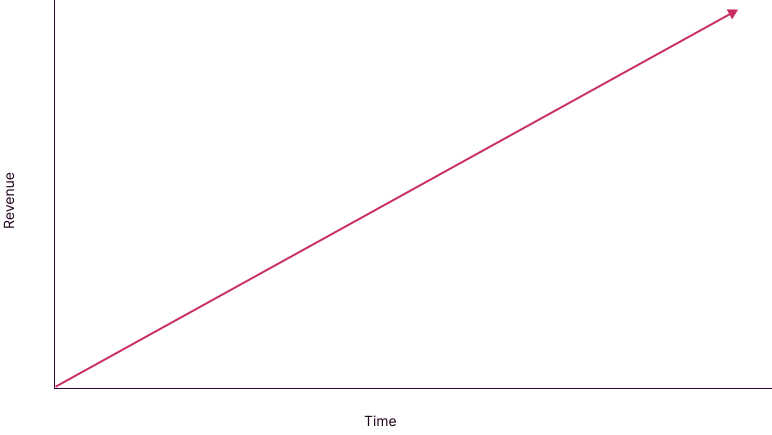

# Business benefits

## For law firms

It's difficult to engage in discussion about legal tech and law firms without considering the traditional law firm business model: *the billable hour*.

The model requires lawyers to record the time they spend on client work in 6 minute increments (time is generally rounded up to the nearest 6 minute block). A bill for a client is calculated based on the time recorded by lawyers, multiplied by their applicable hourly rates.

Through the traditional billable hour model, revenue is tied to time directly:

## For businesses

Okay

## For individuals
