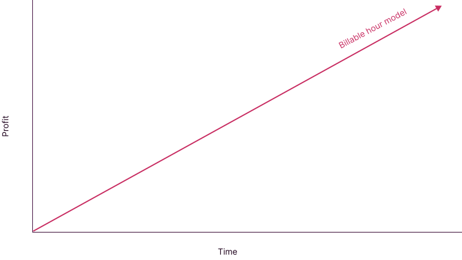
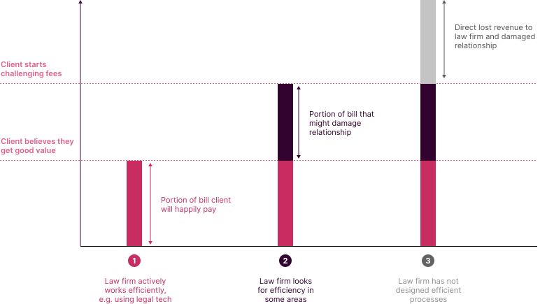
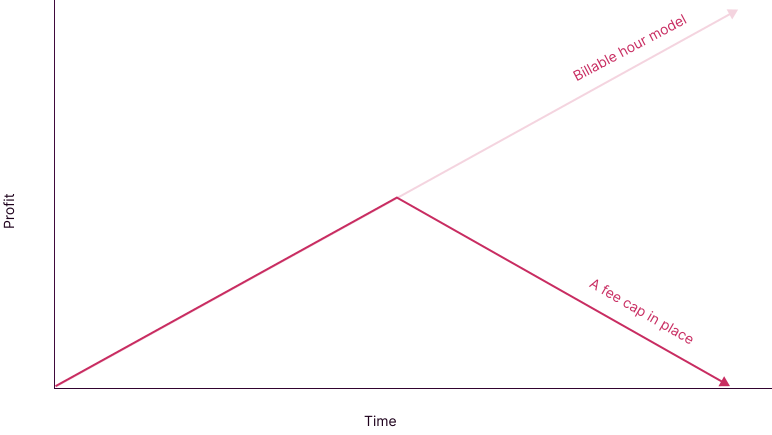
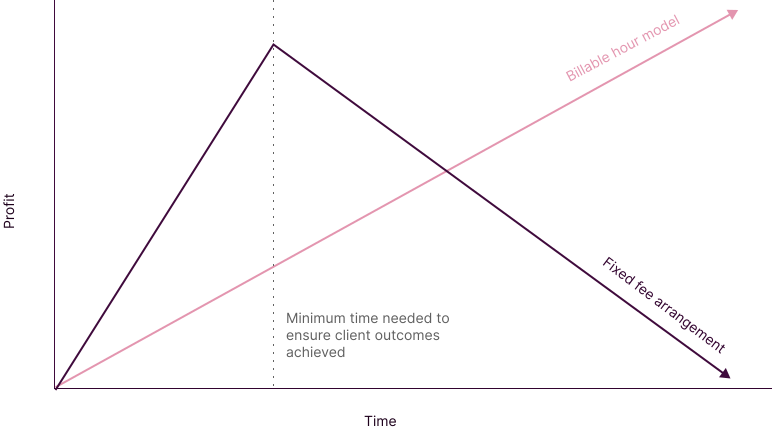

# Law firms

## Billable hours

It's difficult to have a discussion about legal tech without mentioning the fundamental business model of law firms, *the billable hour*. This model requires lawyers to record the time they spend on client work (time is generally rounded up to the nearest 6 minute block). A bill for a client is calculated based on the time recorded by lawyers, multiplied by their applicable hourly rates. Through the traditional billable hour model, revenue is tied to time directly.

A major benefit of introducing legal tech is around operation efficiency. If legal tech reduces the amount of time lawyers are recording, this may have the effect of reducing profits on a pure billable hour model. [Most industry experts agree](https://www.artificiallawyer.com/2020/02/03/killing-time-how-to-end-the-billable-hour-liberate-legal-tech/) that the billable hour business model of law firms has at least some detrimental effect on the adoption of legal tech, because it does not incentivise lawyers to adopt tools that improve efficiency.

However, it is rarely the case that law firms have *carte blanche* over what they choose to charge clients. For law firms under fee pressure from clients, legal tech can play an important role in keeping clients happy that a law firm's costs are reasonable. Keeping bills within this acceptable range is a business imperative for law firms to recover time they spend on projects, win work from new clients and win repeat work from existing clients.

In practice, many lawyers do seek to be efficient despite the apparent mismatch between efficiency and incentives. They do so to provide quicker turnarounds to clients and to reduce the number of steps in a process that could contribute to margin for error. The degree to which lawyers actively take time out of their days to become efficient is largely dependent on culture and business models.

:::note Spend management software
To keep legal fees in check, legal spend management software such as [BusyLamp](https://www.busylamp.com/what-is-legal-spend-management/) can analyse law firm time entries and check duplicate time entries, time spent on manual work (e.g. printing) and inconsistent time entries (e.g. two people in the same meeting recording different time). Such tools are essentially a way of clients ensuring they are getting good value from law firms.
:::

## Fee caps

Fee caps are an extension of the same principle, but the amount a client is willing to pay is written down in the law firm's engagement letter. They have the effect of explicitly breaking the link between a law firm's profitability and the time it records.

Legal tech can have a more explicit effect here, because the law firm knows in advance that it must do something to keep its fees within a limit. Fee caps might have an important role in pitching for new work, because they give a client more certainty on what they will end up paying.

:::note Scope
In practice, the quantum of fee caps is tied closely to the scope of a law firm's engagement. A law firm will generally only agree to a fee cap around a defined scope of work. If that scope changes, it will usually ask clients to revisit the fee cap.
:::

## Alternative fee arrangements

Legal tech is also helpful where bills are not calculated on the basis of recorded time at all. Here, the aim for the law firm will need to get the best possible outcome for their client while expending as little resource as possible. A firm's profitability here is based upon comparing (1) actual time spent, with (2) the amount of time actually necessary to achieve the client's outcomes.

The difference between time actually spent and time actually necessary translates to direct lost profit for the law firm, because it is getting paid irrespective of the time it incurs (provided it achieves a good service level for the client). From a client's perspective, the conversation might switch from from *"you are charging too much"* towards *"you are not spending enough time on this"*.

:::info Examples

The simplest example of an alternative fee arrangement is a "fixed fee" - where the law firm and the client agrees to pay a fixed amount, regardless of how much time the law firm actually spends working. Another example is "contingent fee", where a law firm's fees will depend on a particular outcome being achieved (e.g. a "success fee" if a transaction completes). "No win, no fee" is an example of a contingent fee arrangement, where a firm only gets paid if it wins a court case.

:::

:::tip Why this matters

If you are working on a change initiative in a law firm, it is absolutely crucial to understand the consequence of improving efficiency. For projects operating on a billable hour basis, there is less of a *direct* imperative to improve efficiency than on projects subject to fee caps.

:::
