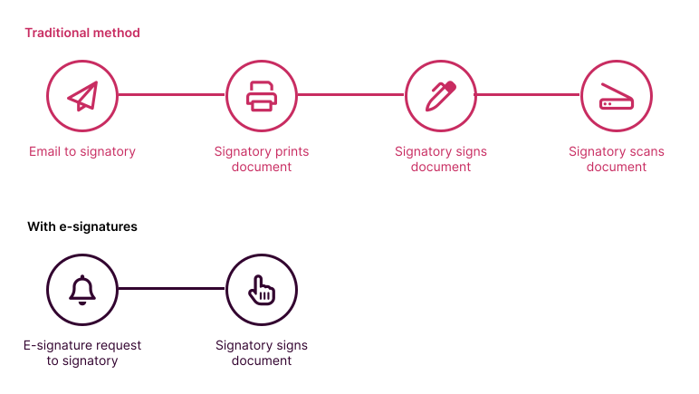

# Corporate legal

## Efficiency

Many in-house teams find themselves under increasing pressure, whether in a company that is scaling quickly or in an industry subject to increasing regulation. Because legal teams are often seen as cost centres in organisations, it can be a struggle to increase headcount to deal with this increasing workload.

While [law firms](./Law-firms) are not always primarily driven through efficiency, efficiency provides a route through these problem for in-house teams. Instead of precious resource being taken up asking the same questions over and over again, or doing manual processes that could be automated, in-house teams can leverage legal tech and better processes to cope with their resourcing challenges.

:::info Example
In-house lawyers using pen and paper-based methods to sign contracts saw bottlenecks emerge. The process was convoluted, involving a person emailing, printing, signing and scanning documents. This distracted in-house lawyers from core tasks. For this reason, in-house legal teams have been very quick to adopt e-signature technology, which vastly improves the process - meaning less resource is dedicated to these processes.

:::

A common complaint of in-house teams is that they receive the same requests from the business time and time again: *"can you send me our standard statement of work"*, *"what is our position around [negotation point]"*. To the extent these questions are straightforward to answer, legal teams can become inefficient if their own time is required to service them.

Instead, content can be produced that allows business to "self-service" common requests, or to produce first drafts of non-business-critical documents such as simple statements of work. A variety of legal technologies could be involved here, such as document automation, workflow tools and document automation. These tools, as well as the processes that sit behind them, have the effect of improving the efficiency of a legal team.

## Managing spend

Aside from efficiency, in-house teams often look to managing their spend on law firms. There is often a delicate balance between building experience in-house (requires time and the right people) versus obtaining advice from an external law firm. Legal tech can play a part in two respects here.

First, in-house teams can track data points relating to the law firms they instruct, such as total spend, overspend and time taken to complete matters. Technology can visualise these data points and helps in-house teams decide which law firms are delivering the most value.

Second, in-house teams may be able to recycle some of the advice they receive from law firms. They can re-use contracts law firms have previously approved on future transactions. They may also re-use advice and opinions received from law firms, reducing the extent to which they ask for advice they have already received.

:::info Example
[Apperio](https://apperio.io) is a tool that provides near-real-time reporting on the fees law firms are incurring during their projects. It allows them to see how legal fees are tracking against projected budget, and what the firm is spending their time on. The tool collects spend from *all* law firms in one place, rather than having to capture data from multiple emails into one place.
:::

## Data

Many businesses enter into thousands of contracts every year. Each contract contains obligations and deadlines that must be complied with. Legal teams often struggle to track the obligations contained in these contracts. In the worst case, for contracts that have been in place for many years, it can even be a challenge to find the final version of the contract.

As businesses scale up, and contractual obligations become more and more complicated, traditional methods of managing contracts (e.g. sending calendar reminders for important deadlines) start to break down. As a result, businesses are starting to place greater importance on these matters.

:::tip Reality check
It's easy to assume that the world's largest corporations have sorted out these problems long ago. In fact, most have not - and many have not solved the most basic problems such as document management and record keeping
:::

In-house teams can deploy legal tech to define processes around how contracts are entered into. As part of these processes, the final versions of contracts, as well as the obligations contained within them, can be tracked - often without the underlying contract actually being opened at all.

Some businesses are looking to go further than this, by not only monitoring the obligations they have entered into, but by analysing these data points and spotting trends. For example, a legal team may wish to see which points are rejected out of hand in the initial phase of a negotiation. They may conclude that the contracting process may be sped up if they adopt a more reasonable position at the outset.

:::info Example
Contract lifecycle management (CLM) tools structure the contracting workflow from beginning to end. They help in-house teams produce first drafts, and track how the document changes from first to final draft. On the way, they track the key data points that are changing - effectively building a database of contractual obligations on the side. Examples of contract lifecycle management tools include [Juro](https://juro.io) and [Ironclad](https://ironclad.io).
:::
