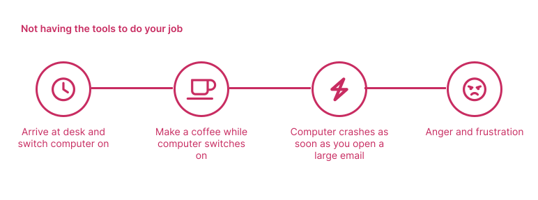
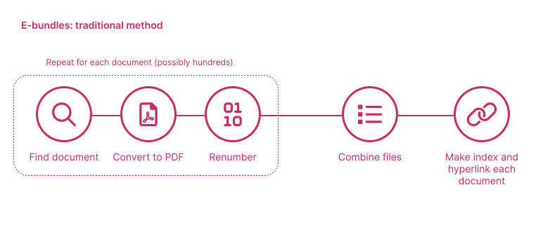
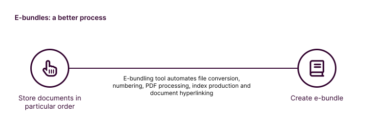

# Lawyers

## Tools to do your job

Start a conversation with a lawyer about technology, and most will express strong opinions about how the tech available to them could be improved. Many complain that their tech is slow (e.g. "*my computer takes 5 minutes to start up each day*"), while others feel they are given the wrong tools for the job (e.g. "*my IT team doesn't understand what I need to do my job*").

Many of the basic tools lawyers use simply do not work in the way they need. Many lawyers still complain about losing changes when their Word processing software crashes. Others complain that their organisation still has no way of sharing files in bulk, other than through email. Some are lacking subscriptions to legal research tools such as Thomson Reuters' *Practical Law* and *LexisNexis* services.

## Better working lives

Lawyers, and those who work alongside them, operate in a highly stressful environment and are under constant time pressure. They are often people with high standards, and are risk averse. They do not like making errors, and they rarely get through their to-do lists. The mental health issues that exist in the legal industry are well documented.

Many of these things are caused by sub-optimal processes and working practices. The problem is exacerbated where the underlying task seems easy, but in reality involves a series of manual steps, each of which could give rise to errors. Even if no errors are actually made, the likelihood of making errors is so high that people often find it difficult to end a day's work without worrying about the mistakes they have made in the working day.

:::info Example
Making a court bundle/binder is a crucial workstream in a piece of litigation. The court bundle usually includes key documents to a dispute, including witness statements and other evidence.

Many teams involved in litigation create the court bundle, nowadays in the form of an *e-bundle*, which is a giant PDF file that incorporates lots of other PDF documents. Creating an e-bundle involves a series of repetitive manual steps.

If the end-result is incorrect, many of the repetitive steps need to be carried out again in their entirety. For example, inserting a document at position "200" in the bundle when it should have been at position "2" means that all documents after position "2" need to be renumbered forward by one.

This is the kind of process that causes junior lawyers stress. Tools exist that automate all of these processes, meaning that changes can be made quickly, and any errors can be corrected easily.

:::

These kinds of processes exist at all ends of the spectrum. They form a large part of a junior lawyer's workload, but senior members of legal teams are ultimately responsible for these processes. And everybody - no matter their seniority - hates dealing with excessive email load and looking disorganised in front of a client.

## Do your job better

Alongside the elimination of things lawyers would rather not do, comes the promise of being able to do things better. Lawyers are asked challenging questions on a daily basis, such as "*what is market practice*", "*what are my chances of winning this litigation*", and even *how much will this project cost*.

Many of these questions are currently answered according to hunches and "finger the air" exercises. Instead, they could be driven by prior experience in a measurable way. This means that lawyers can become true strategic advisors, and deliver predictable and accurate advice in a way they have not been able to do before. 
