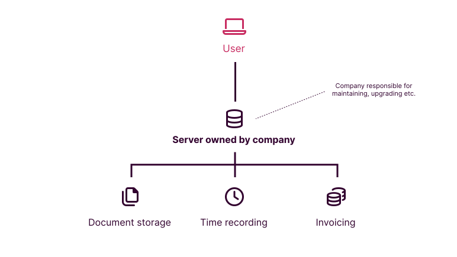
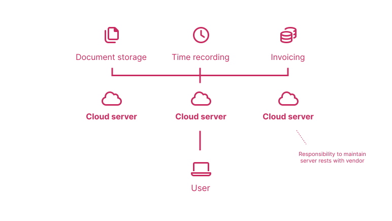

# Cloud

If you are building or buying technology, you must be aware of the distinction between cloud software and on-premises (also known as "*on-prem*" or "*on-premise*") software. More and more organisations are "*moving to the cloud*", which means they will be able to enjoy most modern software offerings. However, a significant proportion (perhaps still the majority) of law firms and legal teams have not yet decided that they are comfortable to use modern cloud solutions.

## On-premises: 1980s - 2010s

When software is deployed on-premises, this means that it is installed on a server that a company physically owns. The company is responsible for installing updates to the software, and for keeping the servers running. Security and access to the server is largely the responsibility of the organisation, albeit vulnerabilities in the actual software deployed will be the responsibility of the company who created the software. When users are accessing on-premises software, they are accessing it through a company-owned server.

A comparison could be made here when you install software on your own computer. Those installation wizards you have to go through are installing software on your *own* computer, rather than somewhere else.

Companies like on-premises software because it gives them control. They have complete control over when they make software updates, so if they think new features will confuse users, they can elect not to update the software. For law firms, security is a key issue, and on-premises software gives organisations complete control over how tightly they want to lock things down, because they are the ones that manage the servers.

### Problems with on-premises

But this ability to manage your own server infrastructure has its downsides. It is expensive to buy and keep servers running. They will also need replacing to make sure they are sufficiently powerful to meet the needs of modern software. This can lead to lengthy and costly upgrade processes.

Maintaining extensive on-premises software requires a dedicated team in its own right to manage servers every day, monitor uptime, and diagnose issues experienced by users. This is a skilled role that requires extensive knowledge. It may not be a skillset that exists at every organisation.

## Cloud: 2010s - present

More and more, consumer software does not require you to download any applications at all. Instead of running from your own computer, it is run from a remote server and your interactions take place through a web browser. Applications such as Google Docs and Dropbox are good examples of cloud software.

The same principle is true for business software. In contrast to on-premises software, cloud software is not hosted in physical servers owned by an organisation. Instead, it is hosted elsewhere by a provider such as Amazon (in *Amazon Web Services* - "AWS") or Microsoft (in *Azure*).

This brings huge advantages for businesses:

* First, they do not have to buy any physical servers. Instead, they can rely on servers owned by a third party.
* Second, these servers are likely to be far more powerful than an organisation would have the resources to buy themselves. This means that applications that require extensive "compute power", such as machine learning (artificial intelligence) services, can be deployed.
* Third, an organisation has very little to do in administering the cloud servers. Most configurations will be made through a control panel, rather than manually logging onto a server and making changers in configuration files directly.

:::info example

The most prominent cloud provider is Amazon, through *Amazon Web Services* (*AWS*). Other cloud providers include Microsoft (*Azure*) and Google (*Google Cloud Platform*). These companies provide services to software vendors, including hosting, data storage, authentication and machine learning. If a piece of software is cloud-based it is likely to be using the services of one of these cloud providers.

:::

## Problems with cloud

### Security

The transition from on-premises to cloud systems is slow for many companies. Security is often cited as a key concern. This is often founded in the fact that with cloud, the company will no longer be undertaking the day-to-day operational aspects of server infrastructure directly. Instead, this work will be carried out by the cloud provider.

The fundamental concern here is usually around a "loss of control" than any tangible reduction in security measures.

In fact, if configured correctly, cloud environments tend to be *more* secure than on-premises environments. They have the benefit of frequent security checks by dedicated security teams. They benefit from the very best compute power, able to run security software that might not be capable of running on-premises. Cloud servers may also maintain backups in multiple data-centers, meaning a reduction in data loss risk.

### Data residency

Law firms and legal teams often deal with sensitive documents, that may need to be adduced as evidence in litigation during a discovery / disclosure exercise. The geographical location of this data can often affect whether or not it can be produced in litigation.

For example, some clients of law firms may become concerned if their data is held in the USA, because this data could fall under the jurisdiction of the US Department of Justice during an investigation. Such organisations are likely to prefer their data to be held in their place of domicile.

This requirement can usually be met in the cloud, since the main cloud providers offer their services in different regions of the world.

### Client consent

This is perhaps the biggest blocker for law firms. For the reasons above, some clients of law firms may have concerns about law firms moving their data into the cloud. In some cases, there may be obligations baked into law firm engagement letters to control where and how their data is stored. Financial services organisations are especially likely to have these requirements.

If clients expect law firms to be able to keep pace with ever-increasing demands on resource, it is unrealistic to expect data to be kept forever on-premises. To do so imposes a huge administrative burden on law firms, and restricts the ability of law firms to use technology effectively.

## Practicalities

### Cloud or not?

If you are looking to deploy software in your organisation, one of your first enquiries should be around your organisation's cloud strategy: *can we deploy cloud software, and if so, in which circumstances?*. If your organisation only supports cloud in limited circumstances, you will have to ask the software vendor whether they can deploy it on-premises.

You should factor in all the disadvantages to on-premises software, and the fact that it is often not as straightforward as simply "upgrading" to cloud in the future. Given data migrations that may be involved, moving a piece of software to cloud from on-premises often involves the same level of effort as deploying cloud software from scratch.

### Moving to Cloud

If you organisation does not have a strategy around moving to the cloud, this is a conversation that should happen as a priority. It is easy to get tied up on all the problems with cloud, but staying in the comfort zone of on-premises comes at a huge cost - namely the inability to take advantage of modern software, and an often excessive administrative burden in maintaining and upgrading servers.
